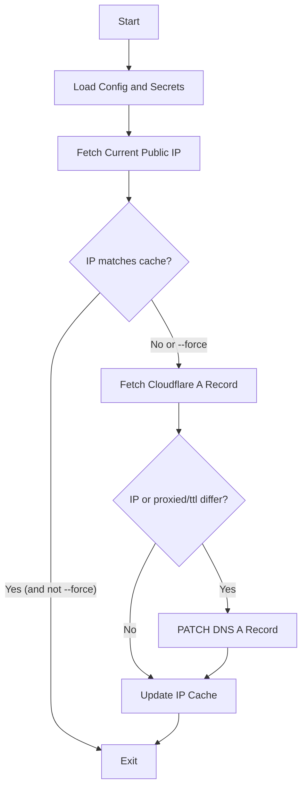

# Architecture: Custom DDNS Client (Rust)

A lightweight, targeted Dynamic DNS (DDNS) client written in Rust, designed to update Cloudflare DNS records when the public IP address of the host changes.

---

## 1. High-Level Workflow

The local cache is a fast pre-check that avoids contacting Cloudflare when the IP is unchanged; `--force` bypasses it. Once the record is fetched, an update is issued whenever the IP **or** the resolved `proxied`/`ttl` differ from Cloudflare, so config overrides are applied even when the IP itself has not changed.

---

## 2. Core Components

### A. Configuration & Secrets Manager
*   **Responsibility**: Load and validate settings (Cloudflare Zone ID, Record Name, TTL, and IP checking endpoints) from a TOML configuration file, and load the Cloudflare API token from a required `.env` file.
*   **Status**: `[Decided]` -> TOML configuration file + required `.env` file for the API token.

### B. IP Fetcher
*   **Responsibility**: Retrieve the host's current public IPv4 address (no IPv6 support) by querying a list of configurable plain-text HTTPS endpoints sequentially until one succeeds.
*   **Status**: `[Decided]`

### C. Cache / State Provider
*   **Responsibility**: Store the last successfully updated IP address in a local plain-text file to minimize redundant Cloudflare API calls. Supports a `--force` flag to bypass the cache.
*   **Status**: `[Decided]` -> Configurable local state file.

### D. Cloudflare Client
*   **Responsibility**: Call the Cloudflare API (directly via HTTP using `reqwest`) to fetch the DNS record ID and update the DNS record with the new IP.
*   **Status**: `[Decided]` -> Direct HTTP requests using `reqwest`.

### E. Runtime / Daemon Orchestrator
*   **Responsibility**: Control how the client runs.
*   **Status**: `[Decided]`: One-shot CLI tool. Relies on system-level schedulers to run periodically. A provided installer (`scripts/install.sh`) deploys the binary to `/usr/local/bin`, config and secret to `/etc/dyndns`, and a systemd **system** timer that runs the client every 300 seconds.

### F. Logging Provider
*   **Responsibility**: Output application execution steps, warnings, and errors to `stdout` and `stderr` dynamically based on configuration.
*   **Status**: `[Decided]` -> Standard `log` facade + `env_logger`.

---

## 3. Design Decisions & Questions Tree

Below is the roadmap of decisions we need to lock down:

1.  **Execution Mode**: `[Decided]` One-shot CLI tool.
2.  **IP Fetching Strategy**: `[Decided]` Sequential fallback over any number of user-configurable plain-text HTTPS endpoints.
3.  **IPv6 Support**: `[Decided]` IPv4 only (A records only, no AAAA records).
4.  **State Management**: `[Decided]` Local cache file storing the last known IP, with a `--force` override option.
5.  **Configuration / Secret Storage**: `[Decided]` TOML configuration file for non-secret settings, with the API token loaded only from a required `.env` file (located next to the config or in the current directory). The config path is taken from `--config`, otherwise searched in order: `./config.toml`, then `/etc/dyndns/config.toml`.
6.  **Cloudflare API Integration**: `[Decided]` Direct HTTP REST requests using `reqwest` (blocking) and `serde`.
7.  **Logging & Error Reporting**: `[Decided]` Standard stdout/stderr output using `log` and `env_logger`. Failed Cloudflare API calls surface the response's structured `errors` array (or raw body) rather than just the HTTP status.
8.  **DNS Record Absence**: `[Decided]` Error out if the record does not exist on Cloudflare, ensuring safety and minimal API scopes.
9.  **Single vs. Multiple Records**: `[Decided]` Support a single DNS record name per configuration file. Multiple records/zones can be managed by running the tool multiple times with different configuration files.
10. **Cloudflare Proxy Status**: `[Decided]` Preserve the existing status from Cloudflare by default, with an optional override setting (`proxied = true/false`) in `config.toml`. When set, the override is applied whenever it differs from Cloudflare, including on a `--force` run with an unchanged IP.
11. **Rust Crate Dependencies**: `[Decided]` Use clap (CLI parsing), reqwest (HTTPS client with rustls-tls), serde/serde_json (serialization), toml (config parsing), and log/env_logger (logging).
12. **Dry Run Mode**: `[Decided]` Include a `--dry-run` CLI flag to simulate the flow without committing changes to disk or making mutating Cloudflare API requests.
13. **DNS Record TTL**: `[Decided]` Preserve the existing TTL from Cloudflare by default, with an optional override setting (`ttl = <seconds>`) in `config.toml`. As with `proxied`, the override is applied whenever it differs from Cloudflare, not only when the IP changes.
14. **Crate Structure**: `[Decided]` Binary-only Rust crate structure (`src/main.rs`).
15. **Cloudflare Authentication Method**: `[Decided]` Support API Tokens only (transmitted via `Authorization: Bearer <TOKEN>`) to enforce secure, least-privilege scoping.
16. **Cloudflare Zone Identification**: `[Decided]` Require the Zone ID directly in the configuration file to avoid unnecessary Zone lookup calls and keep required API token permissions minimal (DNS:Edit only).
17. **Public IP Validation**: `[Decided]` Strictly parse the response using `std::net::Ipv4Addr` to ensure it is a valid IPv4 address before cache checking or sending to Cloudflare. If parsing fails, fall back to the next endpoint.
18. **Post-Update Hooks**: `[Decided]` Do not support internal post-update command execution. Keep the tool focused; if post-update actions are needed, they can be handled via external wrapper scripts checking the tool's status or exit codes.

---

## 4. Technical Stack & Dependencies

The project is implemented in **Rust** using the following libraries:

*   **`clap`** (derive feature): Command line argument parser.
*   **`reqwest`** (blocking, rustls-tls features): Fast, secure, and standalone HTTP client.
*   **`serde`** & **`serde_json`**: Serialization and deserialization of API payloads and structures.
*   **`toml`**: Parse configuration files.
*   **`log`** & **`env_logger`**: Logging facade and environment-configurable logger.
